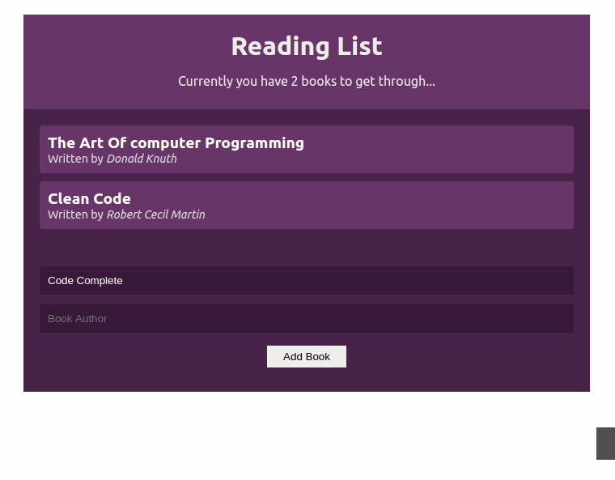

# Book Reading List using React Context API

### Package Used

- `create react app`
- `uuid`

### React Hooks Used

- `useState`
- `useContext`
- `createContext`
- `useEffect`
- `useReducer`

### Demo

